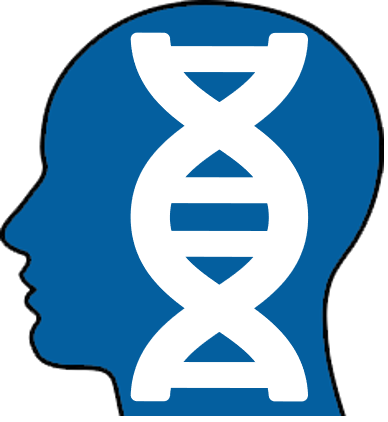
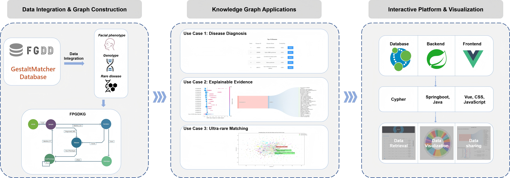
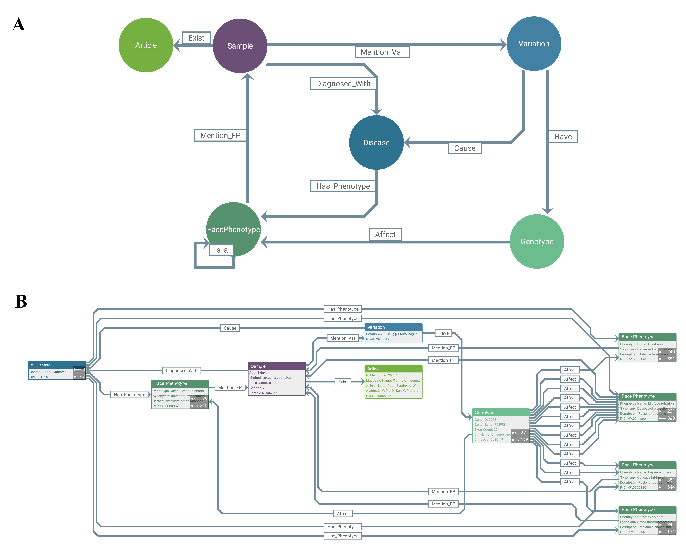
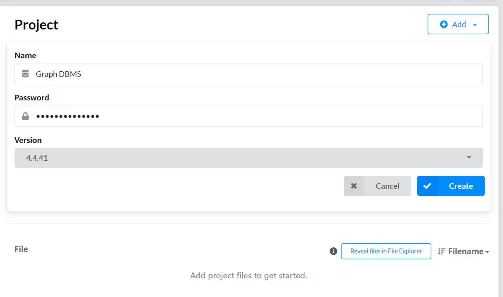
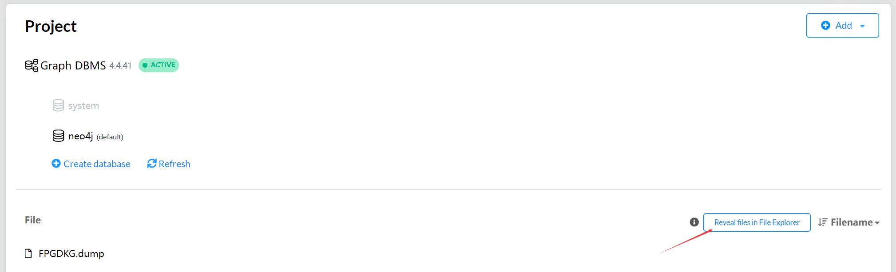
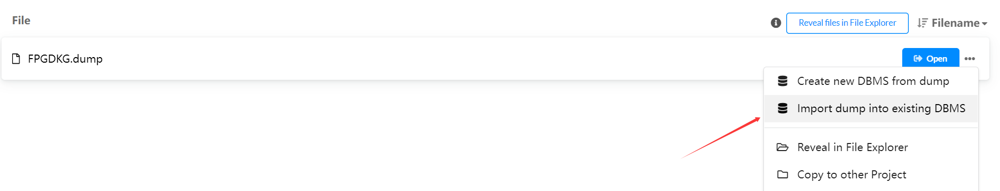
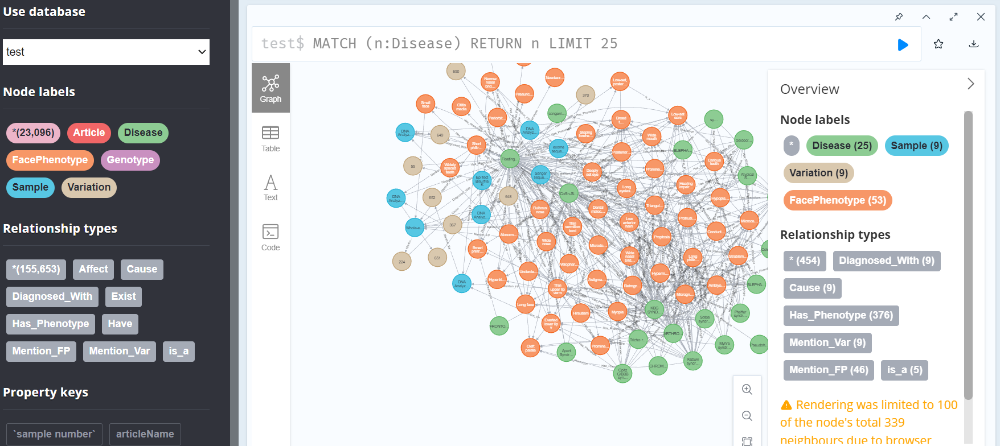

<div align="center">
  
  <h1 style="display: inline; margin-left: 10px;">FPGDKG 1.0: An Integrated Facial Phenotype-Gene-Disease Knowledge Graph for Rare Disease Diagnosis and Explanation</h1>
</div>


[](https://opensource.org/licenses/MIT)

 

## 🌐 Overview


**FPGDKG platform are available at [http://bioinf.org.cn:8060/](http://bioinf.org.cn:8060/)**

<div align="center">

  
*Figure 1. Graphical abstract of this study.*

  
*Figure 2. Example visualization of the knowledge graph*

  
*Figure 3. Knowledge Graph Statistics and Visualizations.*
</div>


## 📁 Repository File Description
```bash
FPGDKG/
├── Data/                      # KG data
│   ├── FPGDKG.dump            # FPGDKG (FGDD part)
│   ├── data_all.xlsx          # FGDD metadata
│   └── Add_GMDB_script.ipynb  # Python script to process GMDB
└── README.md
```
  
## 🚀 KG Installation
Our FPGDKG integrates the data of FGDD and GMDB. Due to the access restrictions of [GMDB](https://db.gestaltmatcher.org/), we only provide the KG download of the FGDD part. You can apply for GMDB and process it using our Add_GMDB.ipynb script. 
### Prerequisites
- Neo4j (v4.4+)
- Java JDK 11+
- Python, pandas, numpy

1. Download FPGDKG.dump file. 
2. Create a new neo4j project, add a new Graph database version=4.4.41. 

3. Reveal files in File Explorer. Put the FPGDKG.dump file in. 

4. Import dump into existing DBMS. 

5. Put GMDB metadata in Data folder, and run Add_GMDB.ipynb step by step.
6. KG installed. 



## 🤝 Contact
For questions or collaborations, please contact: 
hmq0930@163.com,
songjie09_02@163.com

## 📜 License
MIT License  
The full agreement is available in the LICENSE file

## 📚 Citation
FPGDKG is currently undergoing peer review.
```bash

```


