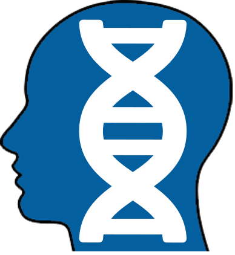
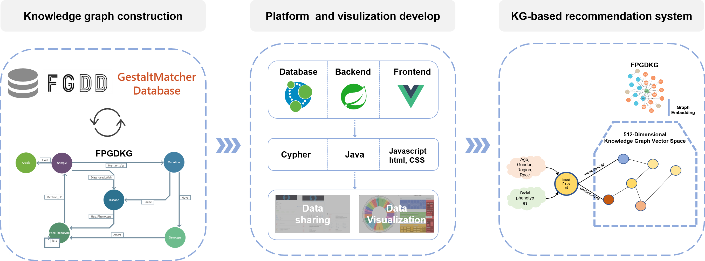
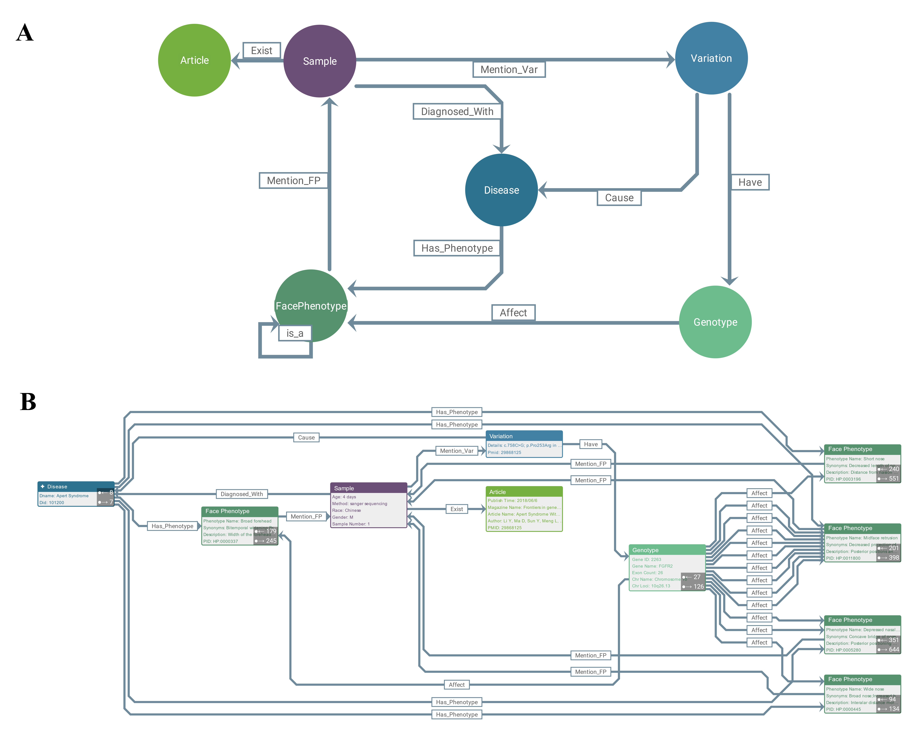
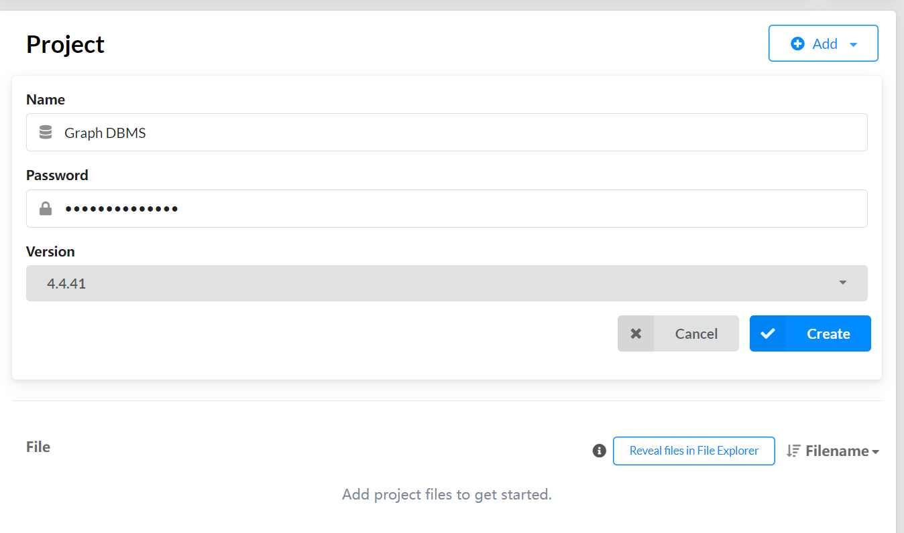
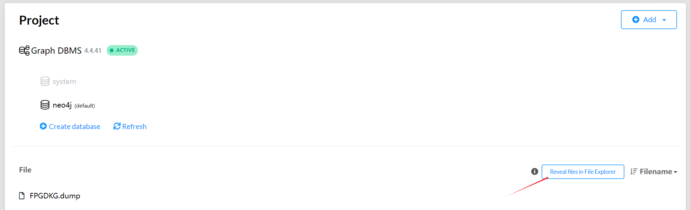
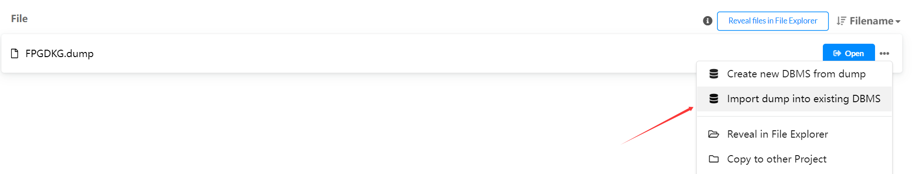
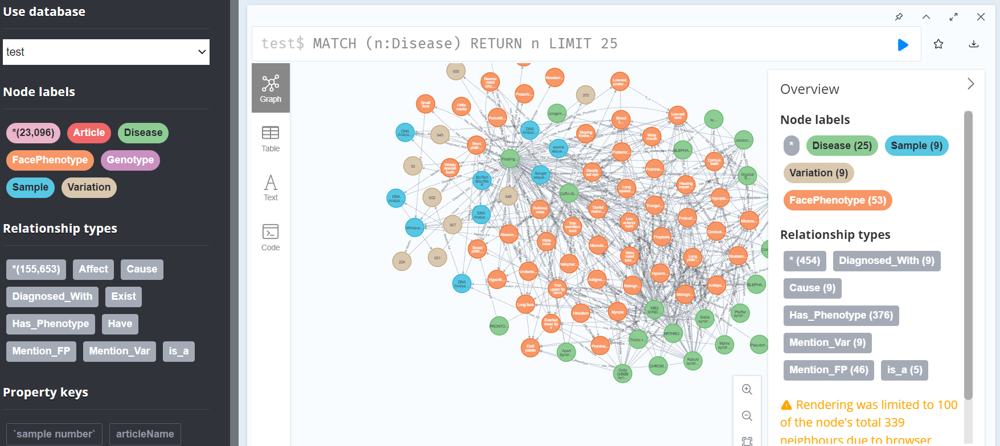

<div align="center">
  
  <h1 style="display: inline; margin-left: 10px;">FPGDKG: A Knowledge Graph  Analytical Platform for Facial Phenotype-Genotype-Disease Associations in Rare Genetic Diseases</h1>
</div>


[](https://opensource.org/licenses/MIT)

 

## 🌐 Overview
FPGDKG is a comprehensive knowledge graph that integrates facial phenotypes, genetic variants, and disease entities into an interconnected network structure to support rare genetic disorder diagnosis. The system contains:
- **Structured Knowledge Representation**: 23,096 nodes (diseases, genes, variants, phenotypes, samples, and articles) and 155,653 relationships across 9 relationship types.
- **Interactive Visualization**: Explore complex phenotype-genotype-disease relationships.
- **Diagnostic Recommendation System**: Find similar cases based on facial phenotypes.
- **Comparative Analysis**: Outperforms LLMs in diagnostic accuracy and interpretability.

**FPGDKG platform are available at [http://bioinf.org.cn:8060/](http://bioinf.org.cn:8060/)**

<div align="center">

  
*Figure 1. Graphical abstract of this study.*

  
*Figure 2. Example visualization of the knowledge graph*
</div>


## 📁 Repository File Description
```bash
FPGDKG/
├── Data/                      # KG data
│   ├── FPGDKG.dump            # FPGDKG (FGDD part)
│   ├── data_all.xlsx          # FGDD metadata
│   └── Add_GMDB_script.ipynb  # Python script to process GMDB
│
├── Recommend                  # Recommendation system code
│   ├──pipeline/
│   │  ├── add_new_node.py
│   │  ├── change_neo4j.py
│   │  ├── construct_nx.py
│   │  ├── cosine_score.py
│   │  ├── embedding.py
│   │  └── graph_sort.py
│   ├── recommend.py
│   ├── reset_neo4j.py
│   └── requirements.txt
└── README.md
```
  
## 🚀 KG Installation
Our FPGDKG integrates the data of FGDD and GMDB. Due to the access restrictions of [GMDB](https://db.gestaltmatcher.org/), we only provide the KG download of the FGDD part. You can apply for GMDB and process it using our Add_GMDB.ipynb script. 
### Prerequisites
- Neo4j (v4.4+)
- Java JDK 11+
- Python, pandas, numpy

1. Download FPGDKG.dump file. 
2. Create a new neo4j project, add a new Graph database version=4.4.41. 

3. Reveal files in File Explorer. Put the FPGDKG.dump file in. 

4. Import dump into existing DBMS. 

5. Put GMDB metadata in Data folder, and run Add_GMDB.ipynb step by step.
6. KG installed. 


## 💡 Recommend System Installation
1. Clone the repository:
   ```bash
   git clone https://github.com/yourusername/FPGDKG.git
   cd FPGDKG
   ```
2. Install requirements: 
    ```bash
    cd Recommend
    pip install -r requirements.txt
    ```
3. Configure your database and password in codes. 
4. Run a test sample： 
    ```bash
    python recommend.py --age "6 y" --race "Turkish" --region "Turkey" --gender "M" --HP "HP:0000343,HP:0012471,HP:0012810,HP:0011822,HP:0000325" --nodeid 8558904
    ```
## 🤝 Contact
For questions or collaborations, please contact: 
hmq0930@163.com,
songjie09_02@163.com

## 📜 License
MIT License  
The full agreement is available in the LICENSE file

## 📚 Citation
FPGDKG is currently undergoing peer review.
```bash

```


